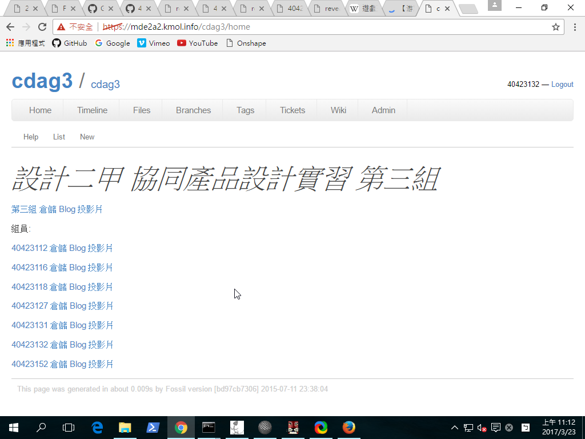

Title: 協同產品設計實習   W5簡報
Date: 2017-03-23 12:08
Category:簡報
Tags:簡報
Author: 2017springcd_ag3

<!-- PELICAN_END_SUMMARY -->

介紹Wiki編輯模式的種類(Fossil Wiki、Markdown、Html)

Solcespace 單連桿與四連桿機構轉入 V-rep 進行運動模擬

V-rep的remote API連結單連桿

